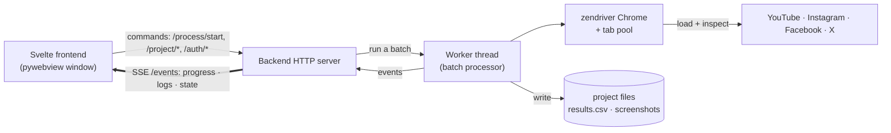

# MCAT

**MCAT (Moderation Content Analysis Tool)** is a desktop app for researchers studying platform content moderation. Given a list of post/video URLs, it checks whether each is still **live**, **restricted** (age-gated, geo-blocked, private), **moderated** (taken down by the platform), or **unavailable** (gone) by loading it in a real browser and inspecting the rendered page — and it can **re-check on a schedule** to capture *when* a piece of content's status changes over time.

It targets **YouTube, Instagram, Facebook, and X (Twitter)**, runs locally as a native window, and writes results to a plain CSV alongside per-URL screenshots, so findings stay auditable and easy to analyze. Nothing leaves your machine except the page loads themselves.

Built with pywebview — a Python backend, a Svelte 5 frontend, and a zendriver-driven Chrome for scraping.

## How it works

MCAT runs as one local app: a Python backend serves the Svelte frontend and exposes a small HTTP API on `127.0.0.1`. The frontend sends **commands** over HTTP (create a project, start/pause a run, set up browser, schedule tracking) and receives **real-time updates** over a Server-Sent Events stream (`/events`) — run progress, activity-log lines, and project-state changes. A run executes on a background worker thread that drives a single Chrome process (via zendriver) with a pool of tabs, checks each URL, and streams results back as it goes.



Commands are plain request/response; everything live (a run's progress, each checked URL, log lines) flows back one-way over the single SSE stream, so the UI stays in sync without polling.

## Prerequisites

- Node.js 20.19+ or 22.12+
- pnpm
- Python 3.10+
- Google Chrome or Chromium (driven by zendriver over the Chrome DevTools Protocol)
- Linux only: system WebKitGTK + PyGObject for pywebview's GTK backend (Fedora: `webkit2gtk4.1`, `gtk3`, `python3-gobject`)

## Setup

```bash
pnpm install
cd app/backend && python3 -m venv --system-site-packages venv
venv/bin/pip install ".[dev]"
```

Dependencies are declared in `app/backend/pyproject.toml` (`zendriver`, `pywebview`; `pyinstaller` + `pyright` under the `dev` extra) — that's the single source of truth, so there's no separate list to install by hand. On macOS, pywebview pulls its native WebKit backend (`pyobjc-*`) automatically. On Linux it uses the **system** WebKitGTK/PyGObject, which is why the venv is created with `--system-site-packages`.

## Development

```bash
pnpm dev              # Start backend + Vite + pywebview window
pnpm dev:mock         # Same, with a mock scraper (no real browser)
```

The backend starts on `127.0.0.1:9876` (fallback to next free port); Vite on `127.0.0.1:5180`. `pnpm dev` runs `app.py`, which spawns Vite itself in dev mode and hot-reloads the frontend. To inspect the UI in a normal browser, open `http://127.0.0.1:5180?port=<backend_port>`.

## Testing

```bash
pnpm test          # Python suite via pytest (needs app/backend/venv set up)
```

Covers `csv_handler` (I/O + delimiter handling), each platform's `_detect_status` detection branches (offline, via fake tabs), the scraping harness — batch orchestration and the per-URL flow: cancel / pause / retry / timeout, no browser — and the cookie store. CI runs it on every push and PR (`.github/workflows/test.yml`). The verified-URL fixtures under `app/tests/fixtures/live/verified/` are ground truth for an optional live (networked) detection check.

## Usage

### Input & output

**Input** is a CSV with at least one column of URLs. A header row is required, but the URL column can be named anything — it's auto-detected and confirmed in the project wizard. Any other columns (titles, IDs, dates) are optional and passed through to the output untouched. The smallest valid file is:

```
url
https://youtube.com/watch?v=...
https://instagram.com/p/...
https://x.com/user/status/...
```

**Output** is written incrementally to `results.csv` in the run folder: the original columns plus `mcat_status`, `mcat_detail`, `mcat_screenshot`, `mcat_timestamp`, `mcat_error`, and `mcat_user`. When screenshots are enabled, they're saved under `screenshots/<status>/`.

### Set up browser (authentication)

**Set up browser** opens a visible Chrome window on the platform so you can dismiss the cookie-consent modal and, where needed, log in. Whatever cookies result (consent cookies, plus session cookies if you logged in) are captured and stored per-project in `<project>/cookies/<platform>.json`, then injected into the tab pool when a run starts. Cookies are captured live during the session (so login cookies are available immediately) and again when the window is closed.

- **No passwords are ever stored** — only cookies, and the activity log prints cookie *names* only, never values.
- **Use a dedicated / throwaway account, never your real one.** Automated logins can get flagged or locked.
- Instagram and Facebook may need login to view content; if their session cookies expire, the scraper reports `Login Required` (Instagram) or an undecided `Unknown` (Facebook), and you re-run Set up browser. YouTube needs no login but shows a consent modal — running Set up browser once captures its `SOCS` consent cookie (~13-month lifetime) so the modal never renders. Recommended in the EU, where an un-set-up YouTube project gets redirected to the consent page and detection degrades.
- X (Twitter) should be **run logged in**. Logged out, X throttles even live tweets to a generic "nothing to see here" page, so a live post can be misread as `Unavailable`; Set up browser → log in to X so the run sees the real tweet.

### Monitoring over time (tracking)

Enable **tracking** to re-run the checks automatically on an interval (minutes / hours / days). Each scheduled run re-checks the project's URLs, so you can capture when content gets taken down or restricted *after* the initial check — the core "moderation over time" use case. The next-check time is shown in the UI; tracking stops when you disable it or close the project.

## Scraping strategies

### General approach

Each scraper drives a Chrome tab via **zendriver** (Chrome DevTools Protocol — no chromedriver) to load the URL and inspect the rendered page. A single Chrome process hosts a pool of tabs (default 3, via `max_zendriver_tabs`); URLs run concurrently across the pool with async I/O, and the whole session is torn down with one `browser.stop()` per run. `tab.get()` awaits page load (30s timeout); on timeout the scraper inspects whatever rendered. After load, detection signals are polled every 0.5s (up to 15s) rather than using a fixed delay, and every tab/CDP call is wrapped in a per-operation timeout so one wedged page can't stall the batch.

Detection reads `body.innerText` (visible text only, not raw HTML, to avoid false positives from JS template strings) and triages in a fixed **order of precedence**:

1. **Negative signals first** — affirmative evidence the content is *gone, moderated, or restricted* (removal/suspension phrases, error icons, age/geo/private markers). Highest priority: a takedown notice must never be overridden by a "looks live" signal.
2. **Positive signals** — affirmative evidence the content is *present* (the rendered post element, `og:title`, the SPA's title element).
3. **Login Required** (Instagram) — a login wall with no other signal.
4. **Unknown** — nothing matched.

**Which signal is checked first flips by platform — always the one that can't be faked:**

- **YouTube / Instagram / Facebook — negatives first.** Their removal notices are platform chrome a live post never contains, and a taken-down page *replaces* the post with that notice; meanwhile their positives (`og:title`, article DOM) leak onto dead pages. So the trustworthy signal is the negative — a takedown notice must override a stale "looks-live" one.
- **X (Twitter) — positive first.** Its gone-phrases (`suspended account`, `nothing to see here`) are ordinary tweet text users actually post, so leading with them would mislabel a live tweet as gone. But X only renders the tweet card when it's genuinely live (never a card *and* a notice), so a rendered card is the one signal user text can't fake — checked first, with the body read for gone-phrases only if no card rendered.

The guiding principle: **`Live` and every negative status (`Moderated`, `Unavailable`, `Restricted`) require their own affirmative evidence — none is ever a guess.** A page is never called `Live` until all negative checks fail *and* a positive signal is found. When neither is found, the result is **`Unknown`** (the genuine fallback) for a human to judge from the screenshot — the scraper never defaults absence-of-removal to "live."

Statuses the system can emit:

| Status | Meaning |
|--------|---------|
| `Live` | content is present and accessible |
| `Restricted` | present but gated — age-gated, geo-blocked, or private |
| `Moderated` | taken down by platform enforcement — a suspended account or terminated channel |
| `Unavailable` | gone, with no attributable cause — deleted, 404, or expired |
| `Login Required` | an auth wall blocked the check; the content itself may still be live |
| `Unknown` / `Error` / `Cancelled` | universal: nothing matched / the probe failed / the run was stopped |

Following *simplicity in the status, nuance in the detail*, the specific reason — `age-restricted`, `geo-blocked`, `private`, `removed by uploader`, `suspended account` — is recorded in `mcat_detail` rather than spawning its own status. When screenshots are enabled, a `Live` post additionally waits for its main image to paint before capture, so the screenshot shows the post rather than a loading skeleton.

Consent modals are never dismissed in-scraper — the consent cookie captured during **Set up browser** is injected into every tab, so the modal simply never renders.

### YouTube

The page title is captured immediately after `tab.get()` returns, before YouTube redirects incognito browsers to its consent page. This initial title is a fallback `Live` signal when the SPA doesn't fully render. Set up browser injects the consent cookie and prevents the redirect entirely.

| Status | Signal (reason recorded in `mcat_detail`) |
|--------|--------|
| Unavailable | Text: "video unavailable", "this video isn't available", "removed by the user" |
| Moderated | Text: "account has been terminated" |
| Restricted | Text: "age-restricted" / "sign in to confirm your age" (age); "not available in your country" (geo); "private video" (private); DOM: elements with `warning` or `restricted` in class name |
| Live | DOM: `h1.ytd-watch-metadata` via `innerText` (handles hashtag-only titles); fallback: page title matches `"<Title> - YouTube"` |
| Unknown | No signal found after timeout |

### Instagram

Works without login (Instagram shows post previews to anonymous visitors). With authentication, the scraper gets a full view of the content.

| Status | Signal |
|--------|--------|
| Unavailable | Page title contains "isn't available"; error SVG `svg[aria-label="error"]`; text: "post isn't available", "sorry, this page isn't available", "page not found" |
| Live | Meta tag `og:title` contains `" on Instagram:"`; fallback: `article[role="presentation"]` (logged-in view) |
| Login Required | Login wall detected ("log in" + "sign up" in body text) with no other signal |
| Unknown | No signal found after timeout |

### Facebook

Posts are partially visible without login. Unavailable posts load fast (~0.7s) with a clear error; live posts take longer (~4–9s) as the SPA renders.

There is deliberately no login-wall branch: every anonymous page embeds a login form, so there is no reliable per-post login signal. An undecided page returns `Unknown` for a human to judge from the screenshot.

| Status | Signal |
|--------|--------|
| Unavailable | Text: "this content isn't available", "this page isn't available", "this content has been removed", "the link you followed may be broken", "page not found" |
| Live | DOM: `div[role="article"]`; fallback: `og:title` meta or page title `"... \| Facebook"`, but only when they carry real content (generic "Facebook" / "Log in to Facebook" titles are ignored) |
| Unknown | No signal found after timeout |

### X (Twitter)

X renders a tweet only when it's live, so detection is **positive-first**: a rendered tweet is conclusive proof of `Live`, checked before the negative phrases. Run logged in — logged out, X throttles even live tweets to a generic "nothing to see here" page that's indistinguishable from a real takedown. Only phrases confirmed by live probing are matched.

| Status | Signal |
|--------|--------|
| Live | Page title contains `" on X:"`; `og:title` contains `" on X"`; DOM: `article[data-testid="tweet"]` |
| Moderated | Text: "suspended account" (logged-in: "This Post is from a suspended account") |
| Restricted | Text: "protected account" ("This Post is from a protected account" — owner-gated, visible only to approved followers) |
| Unavailable | Text: "nothing to see here" (logged-out "gone" page); page title is exactly `"X / ?"` |
| Unknown | No signal found after timeout |

## Project structure

```
MCAT/
├── app/                       # the desktop app (pnpm workspace + Python)
│   ├── frontend/          # Svelte 5 UI (Vite)
│   │   ├── src/
│   │   │   ├── lib/       # Components, stores, api
│   │   │   ├── types/     # Shared TypeScript types
│   │   │   └── themes/    # Color themes
│   │   └── public/fonts/  # Custom fonts
│   ├── backend/           # Python backend
│   │   ├── mcat/
│   │   │   ├── api/       # HTTP handlers, router (also serves the built SPA)
│   │   │   ├── scrapers/  # Platform scrapers (detection only)
│   │   │   ├── services/  # Project/run/processing/tracking/login services
│   │   │   ├── core/      # Batch processor, zendriver browser session
│   │   │   ├── models/    # Data models
│   │   │   └── app.py     # Entry point
│   │   ├── pyproject.toml # Dependencies (single source of truth)
│   │   └── venv/          # Python virtual environment
│   └── tests/
│       ├── mock_scraper.py          # Mock scraper for dev
│       ├── mock_scraper_factory.py  # Wires the mock into the batch pipeline
│       ├── fixtures/                # Test URLs and scenarios
│       └── test_cookie_store.py     # Cookie store round-trip test
└── build/                     # Linux AppImage / macOS packaging config
```

## Building & installing

### Linux (AppImage)

```bash
pnpm build:linux          # or: ./build/build-linux.sh   →   build/MCAT-x86_64.AppImage
```

A single double-clickable file that runs on any glibc-compatible distro. The pipeline (`build/build-linux.sh`, idempotent — safe to re-run) is four isolated steps:

1. **Frontend** — `pnpm --filter frontend build` → `app/frontend/dist/`
2. **PyInstaller** — reads `app/backend/mcat.spec` → `app/backend/dist/mcat/` (onedir: executable + Python libs + bundled frontend)
3. **AppDir** — copies the bundle into `build/MCAT.AppDir/` with the AppImage layout (`AppRun`, `*.desktop`, `*.png`, `usr/bin/`)
4. **AppImage** — `appimagetool` on the AppDir → the final `.AppImage`

Supporting files in `build/`: `AppRun` (launcher that invokes `usr/bin/mcat`), `mcat.desktop` (app metadata read by file managers), `mcat.png` (256×256 icon; falls back to a 1×1 placeholder if missing), and `appimagetool-x86_64.AppImage` (downloaded on first run). The staging `MCAT.AppDir/` and the final `.AppImage` are gitignored. Outside `build/`, the relevant files are `app/backend/mcat.spec` (PyInstaller config), `app/backend/hooks/hook-webview.py` (collects pywebview's GTK/WebKit typelibs), and `app.py`'s `sys.frozen` branch (repoints the frontend dir at the bundled location at runtime).

**Linux troubleshooting:**
- *"QT cannot be loaded" at launch* — the WebKit typelibs weren't collected; check `app/backend/hooks/hook-webview.py` (it tries WebKit2 4.1 then 4.0 — add your distro's version if different).
- *Bundle much larger than expected (~200 MB+)* — verify `app/backend/mcat.spec`'s `excludes=` list; PyInstaller otherwise pulls in Qt/tkinter when pywebview is present.
- *"Frontend build not found" from PyInstaller* — you ran it without building the frontend; use `./build/build-linux.sh`, or run `pnpm --filter frontend build` first.
- *No browser at runtime* — zendriver drives the **system** Chrome/Chromium, which must be installed; a fresh machine needs it present.

### macOS (`.app`)

```bash
pnpm build            # build the frontend first
cd app/backend && venv/bin/python -m PyInstaller --clean mcat.spec   # → app/backend/dist/MCAT.app
```

The GitHub Actions workflow (`.github/workflows/build-macos.yml`) builds both arm64 (Apple Silicon, on `macos-26`) and x86_64 (Intel, on `macos-15-intel`) bundles on pushes to `build`. At runtime the app serves the built SPA from its own backend so the UI and API share one origin — required on macOS, where a `file://` page is blocked from reaching the `http://` backend.

**Installing on macOS:** move `MCAT.app` into `/Applications`, and keep your **projects in `~/Documents`** (or anywhere outside the app) — never store project data next to the app, or replacing the app on update will delete your runs. The bundles are unsigned, so first launch needs a Gatekeeper override: `xattr -dr com.apple.quarantine MCAT.app`, then open it.

## License

MCAT is licensed under the [European Union Public Licence v. 1.2](LICENSE) (EUPL-1.2).

Third-party bundled assets (fonts) carry their own licenses in [`LICENSES/`](LICENSES/).
