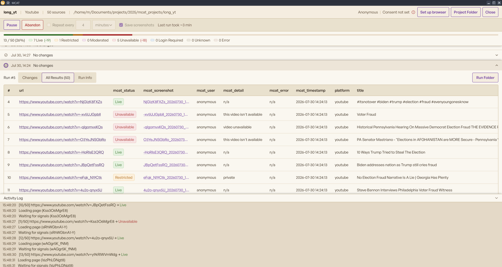

# MCAT



**MCAT**, the Moderation Content Analysis Tool, is a desktop app for researchers studying platform content moderation. Given a list of post/video URLs, it checks whether each is still **live**, **restricted**, **moderated**, or **unavailable** by loading it in a real browser and inspecting the rendered page. It can also **re-check on a schedule** to capture *when* a piece of content's status changes over time.

It targets **YouTube, Instagram, Facebook, and X**, runs locally as a native window, and writes results to a plain CSV alongside per-URL screenshots, so findings stay auditable and easy to analyze. Nothing leaves your machine except the page loads themselves.

Built with pywebview: a Python backend, a Svelte 5 frontend, and a zendriver-driven Chrome for scraping.

## Contents

- [Project structure](#project-structure)
- [Prerequisites](#prerequisites)
- [Setup](#setup)
- [Development](#development)
- [Testing](#testing)
- [Building & installing](#building--installing)
  - [Linux](#linux)
  - [macOS](#macos)
- [Usage](#usage)
  - [Input & output](#input--output)
  - [Content states](#content-states)
  - [Set up browser](#set-up-browser)
  - [Monitoring over time](#monitoring-over-time)
- [Scraping strategies](#scraping-strategies)
  - [General approach](#general-approach)
  - [YouTube](#youtube)
  - [Instagram](#instagram)
  - [Facebook](#facebook)
  - [X](#x)
- [License](#license)

## Project structure

```
MCAT/                              # pnpm workspace monorepo
└── packages/
    ├── app/                       # desktop app, Svelte 5 frontend and Python backend
    │   ├── frontend/              # Svelte 5 UI, Vite
    │   │   └── src/               # components, stores, api, types
    │   ├── backend/
    │   │   ├── mcat/              # api, scrapers, services, core, models, app.py
    │   │   └── pyproject.toml     # dependencies, single source of truth
    │   ├── tests/                 # pytest suite, mock scraper, fixtures
    │   └── build/                 # Linux AppImage and macOS packaging config
    ├── website/                   # SvelteKit static site, docs and policy diffing
    │   ├── src/
    │   │   ├── routes/            # home, docs, policies
    │   │   ├── lib/               # components, data, types, seo, scroll-spy
    │   │   └── content/           # markdown pages plus the policy corpus, corpus is local only
    │   ├── static/policies/       # generated diff data, committed and served as is
    │   └── scripts/               # build-policies.ts, corpus to deduped diff data
    └── shared-ui/                 # @mcat/shared-ui: Svelte 5 primitives and theme tokens
```

## Prerequisites

- Node.js 20.19+ or 22.12+
- pnpm
- Python 3.10+
- Google Chrome or Chromium, driven by zendriver over the Chrome DevTools Protocol
- Linux only: system WebKitGTK and PyGObject for pywebview's GTK backend. On Fedora, install `webkit2gtk4.1`, `gtk3`, and `python3-gobject`.

## Setup

```bash
pnpm install
cd packages/app/backend && python3 -m venv --system-site-packages venv
venv/bin/pip install ".[dev]"
```

Dependencies are declared in `packages/app/backend/pyproject.toml`, the single source of truth, so there's no separate list to install by hand. It lists `zendriver` and `pywebview`, with `pyinstaller` and `pyright` under the `dev` extra. On macOS, pywebview pulls its native WebKit backend automatically. On Linux it uses the **system** WebKitGTK and PyGObject, which is why the venv is created with `--system-site-packages`.

## Development

```bash
pnpm dev:app          # start backend + Vite + pywebview window
pnpm dev:app:mock     # same, with a mock scraper, no real browser
```

The backend starts on `127.0.0.1:9876`, or the next free port if that one is taken; Vite on `127.0.0.1:5180`. `pnpm dev:app` runs `app.py`, which spawns Vite itself in dev mode and hot-reloads the frontend. To inspect the UI in a normal browser, open `http://127.0.0.1:5180?port=<backend_port>`.

## Testing

```bash
pnpm test          # Python suite via pytest; needs the backend venv
```

Covers the CSV handler, each platform's `_detect_status` branches offline via fake tabs, the scraping harness, and the cookie store. CI runs it on every push and PR. The verified-URL fixtures under `packages/app/tests/fixtures/live/verified/` are ground truth for an optional live detection check.

## Building & installing

### Linux

```bash
pnpm build:linux          # → packages/app/build/MCAT-x86_64.AppImage
```

### macOS

```bash
pnpm build                                                                    # frontend
cd packages/app/backend && venv/bin/python -m PyInstaller --clean mcat.spec   # → dist/MCAT.app
xattr -dr com.apple.quarantine dist/MCAT.app                                  # unsigned; clear Gatekeeper
mv dist/MCAT.app /Applications
```

Store projects outside the app, for example in `~/Documents`. Updating the app deletes anything stored beside it.

## Usage

### Input & output

**Input** is a CSV with at least one column of URLs. A header row is required, but the URL column can be named anything; it is auto-detected and confirmed in the project wizard. Any other columns such as titles, IDs, or dates are optional and passed through to the output untouched. The smallest valid file is:

```
url
https://youtube.com/watch?v=...
https://instagram.com/p/...
https://x.com/user/status/...
```

**Output** is written incrementally to `results.csv` in the run folder: the original columns plus `mcat_status`, `mcat_detail`, `mcat_screenshot`, `mcat_timestamp`, `mcat_error`, and `mcat_user`. When screenshots are enabled, they are saved under `screenshots/<status>/`.

### Content states

Every checked URL gets one `mcat_status`. The specific reason, such as age-restricted, geo-blocked, removed by uploader, or suspended account, is recorded separately in `mcat_detail` rather than spawning its own state.

| State | Meaning | Platforms |
|---|---|---|
| **Live** | Loads and is publicly viewable | all |
| **Restricted** | Present but access-gated: age-restricted, geo-blocked, or private | YouTube, X |
| **Moderated** | Taken down by platform enforcement: a suspended account or terminated channel | YouTube, X |
| **Unavailable** | Gone: deleted by the uploader, a 404, or expired | all |
| **Login Required** | An auth wall blocked the check; the content itself may still be live | Instagram |
| **Unknown** | Loaded but nothing matched, left for a human to judge from the screenshot | all |
| **Error** | The check itself failed: no load, a timeout, or a crash | all |

### Set up browser

**Set up browser** opens a visible Chrome window so you can dismiss the cookie-consent modal and, where needed, log in. The resulting cookies are stored per-project in `<project>/cookies/<platform>.json` and injected into the tab pool at run start. No passwords are stored, only cookies, and the activity log prints cookie *names*, never values, so use a dedicated or throwaway account, never your real one. Instagram and Facebook may need a login; when their session cookies expire the scraper reports `Login Required` or an undecided `Unknown`, so you re-run it. YouTube needs no login but should be run once to capture its `SOCS` consent cookie, especially in the EU where an un-set-up project is redirected to the consent page. X should be run **logged in**, since logged out it throttles even live tweets to a generic page that misreads as `Unavailable`.

### Monitoring over time

Enable **tracking** to re-run the checks automatically on an interval of minutes, hours, or days. Each scheduled run re-checks the project's URLs, so you can capture when content gets taken down or restricted *after* the initial check. This is the core moderation-over-time use case. The next-check time is shown in the UI; tracking stops when you disable it or close the project.

## Scraping strategies

### General approach

Each scraper drives a Chrome tab via **zendriver**, over the Chrome DevTools Protocol with no chromedriver, to load the URL and inspect the rendered page. A single Chrome process hosts a pool of tabs; URLs run concurrently with async I/O, `tab.get()` awaits load, and every tab and CDP call is wrapped in a timeout so one wedged page cannot stall the batch. After load, detection signals are polled rather than waited on a fixed delay.

Detection reads `body.innerText`, the visible text rather than raw HTML, which avoids false positives from JS template strings. It triages in a fixed order: **negative signals first**, meaning evidence the content is gone, moderated, or restricted, so a takedown notice is never overridden by a looks-live signal; then **positive signals** such as the rendered post, `og:title`, or the SPA title; then a **login wall**; then **Unknown**.

**Which signal is trusted first flips by platform, always the one that cannot be faked:**

- **YouTube, Instagram, Facebook: negatives first.** A taken-down page *replaces* the post with a removal notice that a live post never contains, while their positive signals leak onto dead pages, so the negative is the trustworthy one.
- **X: positives first.** Its gone-phrases like `suspended account` or `nothing to see here` are ordinary tweet text users post, but X renders a tweet card *only* when the post is genuinely live, so the card is the one signal user text cannot fake.

The principle: **`Live` and every negative state require their own affirmative evidence, never a guess.** A page is called `Live` only when all negative checks fail *and* a positive is found; otherwise the result is `Unknown`, left for a human to judge from the screenshot. Consent modals are never dismissed in-scraper; the cookie captured during **Set up browser** is injected into every tab so the modal never renders.

### YouTube

Captures the page title immediately after load, before YouTube redirects an un-set-up incognito browser to its consent page, as a fallback `Live` signal. Negatives first: visible text is matched for removal, age, geo, private, and channel-termination markers. `Live` needs the rendered video-title element, or a `"<Title> - YouTube"` page title.

### Instagram

Works without login, since Instagram shows post previews to anonymous visitors, though authentication gives a fuller view. Negatives first via the page title and an error SVG; `Live` is confirmed by the `og:title` post caption, or the logged-in article DOM. A bare login wall with no other signal is the one case that returns `Login Required`.

### Facebook

The coarsest of the four; in practice it only distinguishes `Live` from `Unavailable`. Posts are partially visible when logged out: unavailable pages load fast with a clear error, live pages render slowly. There is deliberately no login-wall branch, because every anonymous page embeds a login form and so there is no reliable per-post signal, so an undecided page returns `Unknown`.

### X

Positive-first: X renders a tweet card only when the post is genuinely live, so a rendered card is conclusive `Live`, checked before any negative phrase. Run logged in. Logged out, X throttles even live tweets to a generic "nothing to see here" page indistinguishable from a real takedown.

## License

MCAT is licensed under the [European Union Public Licence v. 1.2](LICENSE).

Third-party bundled assets such as fonts carry their own licenses in [`LICENSES/`](LICENSES/).
