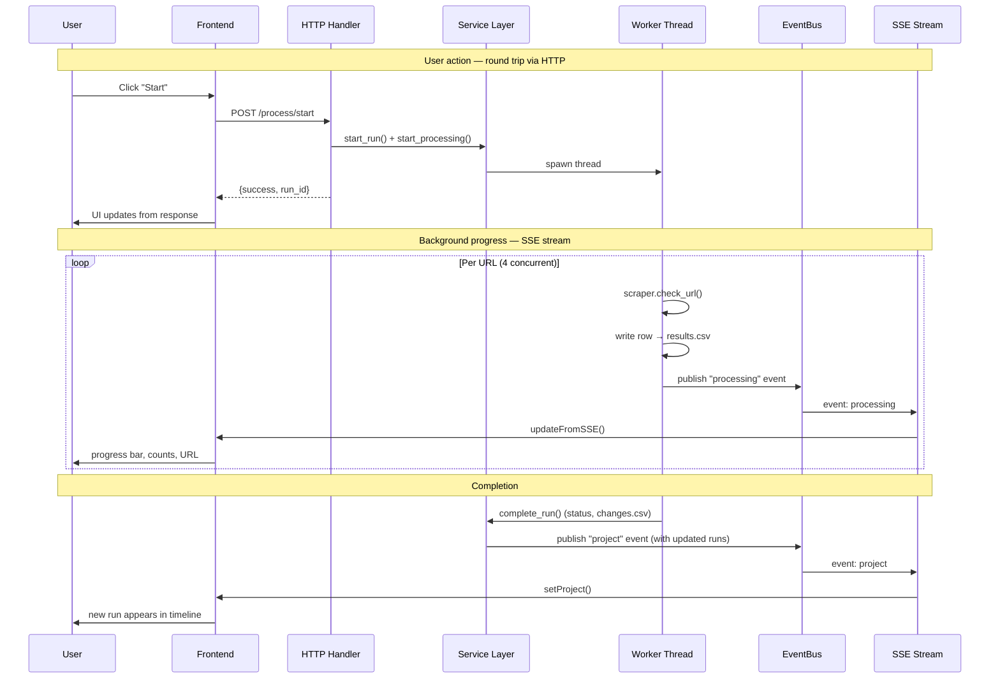

# MCAT Architecture

MCAT is a desktop app for monitoring content moderation status across social platforms. It wraps a Python backend (HTTP server + Selenium scrapers) in a pywebview window, with a Svelte 5 frontend served by Vite in dev and from a built `dist/` in production.

**Communication model:** user-initiated actions use plain HTTP request/response. Background events (processing progress, tracking timer fires, log messages) stream from backend to frontend via Server-Sent Events on `/events`.

---

## Data Flow

The key principle: the HTTP response is the source of truth for the action the user just took. SSE is only for data that changes without the user doing anything — progress from the worker thread, runs completing, the tracking timer firing.

---

## SSE Event Types

| Event | Published By | Frontend Handler |
|-------|--------------|------------------|
| `processing` | Worker thread via `dispatcher` signals | Updates `processingStore` — progress %, status counts, current URL |
| `project` | `_on_processing_completed`, tracking timer | Updates `projectStore` — adds completed run, updates `next_check` |
| `log` | `log_buffer.add()` from any service | Appends to `consoleStore` — shows in Activity Log |

---

## Scraper Detection Strategies

All scrapers use headless Chrome via Selenium with a shared driver pool, no login required. Each returns a `ScrapingResult` with a `status` and optional `info` (the specific text that matched). The detection logic exhausts known error patterns first, then requires a positive signal for Live. If neither matches → **Unknown** (researcher can verify via screenshot).

### YouTube

| Order | Check | Status |
|-------|-------|--------|
| 1 | Body text contains `"video unavailable"`, `"this video isn't available"`, `"removed by the user"`, `"account has been terminated"` | Removed |
| 2 | Body text contains `"age-restricted"`, `"sign in to confirm your age"` | Age-restricted |
| 3 | Body text contains `"not available in your country"` | Geo-blocked |
| 4 | Body text contains `"private video"` | Private |
| 5 | Warning/restricted element present with non-empty text | Restricted |
| 6 | `h1.ytd-watch-metadata` video title present | Live |
| — | None matched | Unknown |

Also dismisses the cookie consent modal before detection.

### Instagram

| Order | Check | Status |
|-------|-------|--------|
| 1 | `svg[aria-label="error"]` present | Removed |
| 2 | Body text contains `"post isn't available"`, `"sorry, this page isn't available"`, `"page not found"` | Removed |
| 3 | Error container div (`.x9f619.xjbqb8w.x78zum5`) with keyword text | Removed |
| 4 | `article[role="presentation"]` present | Live |
| — | None matched | Unknown |

### Facebook

| Order | Check | Status |
|-------|-------|--------|
| 1 | Moderation overlay div (`.xzueoph.x1k70j0n`) contains text | Restricted |
| 2 | Body text contains `"this content isn't available"`, `"content has been removed"`, etc. | Removed |
| 3 | `div[role="article"]` present | Live |
| — | None matched | Unknown |

### Twitter / X

Uses a different approach — full page text scanning against a curated dictionary of ~60 known moderation notices. More resilient because notice text stays stable while DOM changes frequently.

| Order | Check | Status |
|-------|-------|--------|
| 1 | Scroll page to load lazy content | — |
| 2 | Match against `REMOVED_NOTICES` (suspended accounts, deleted posts, rule violations removing content) | Removed |
| 3 | Match against `RESTRICTED_NOTICES` (age-restricted, sensitive, withheld, disputed, community notes, rule violations with "remain accessible") | Restricted |
| 4 | Match against `ERROR_NOTICES` (`"Something went wrong"`) | Error |
| 5 | `article[data-testid="tweet"]` present | Live |
| — | None matched | Unknown |

The matched notice text is stored in `status_detail` so the researcher sees the exact moderation label Twitter displayed.

---

## Key Files

**Backend**
- `backend/mcat/app.py` — entry point: spawns HTTP server, Vite dev server, pywebview window
- `backend/mcat/server.py` — `BaseHTTPRequestHandler` with SSE endpoint
- `backend/mcat/api/router.py` — route → handler mapping
- `backend/mcat/api/handlers/*.py` — one file per domain (project, processing, run, tracking, csv, dialog)
- `backend/mcat/api/context.py` — `AppContext` singleton holding services, `EventBus`, `LogBuffer`
- `backend/mcat/services/*.py` — business logic: project lifecycle, run lifecycle, processing coordinator, tracking scheduler
- `backend/mcat/core/batch_processor.py` — thread pool + scraper invocation + incremental CSV write
- `backend/mcat/core/driver_manager.py` — Chrome driver pool
- `backend/mcat/scrapers/*.py` — one per platform, plus `base_scraper.py`
- `backend/mcat/models/project_models.py` — `ProjectConfig`, `RunConfig`, `TrackingConfig` (serialized to `project.json`)

**Frontend**
- `frontend/src/App.svelte` — top-level view router (start / wizard / project)
- `frontend/src/lib/views/` — full-screen views
- `frontend/src/lib/stores/` — Svelte 5 `$state` stores; SSE listener populates them
- `frontend/src/lib/api/client.ts` — typed fetch wrappers for every endpoint
- `frontend/src/lib/api/sse.ts` — `EventSource` listener, routes events to stores
- `frontend/src/lib/components/` — reusable UI (DataTable, TransitionBadge, etc.)
- `frontend/src/themes/*.css` — swappable color themes; active one imported by `app.css`

**Data on disk** (per project folder)
- `project.json` — name, platform, runs list, tracking config
- `urls.csv` — source URLs (user's input CSV)
- `runs/{run_id}/results.csv` — scraper output: original CSV columns + `status`, `status_detail`, `status_screenshot`, `status_timestamp`, `status_error`
- `runs/{run_id}/changes.csv` — diff vs previous run: `url`, `previous_status`, `new_status`
- `runs/{run_id}/screenshots/{status}/` — saved screenshots when enabled
