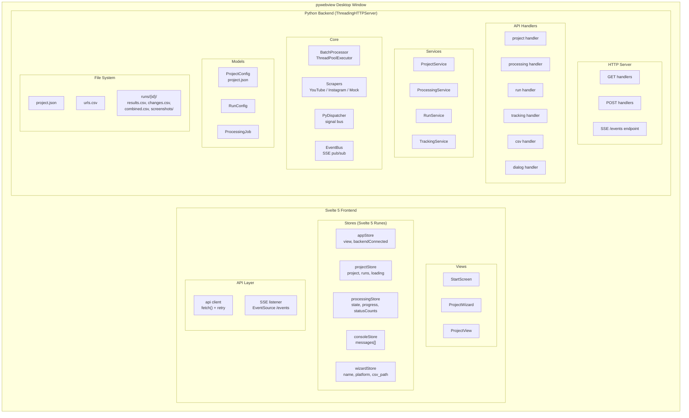
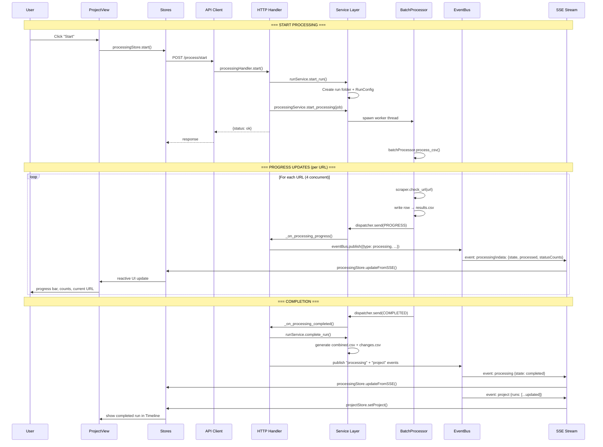
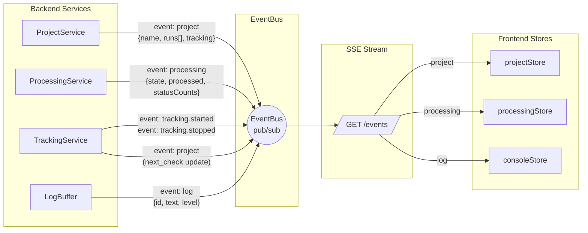
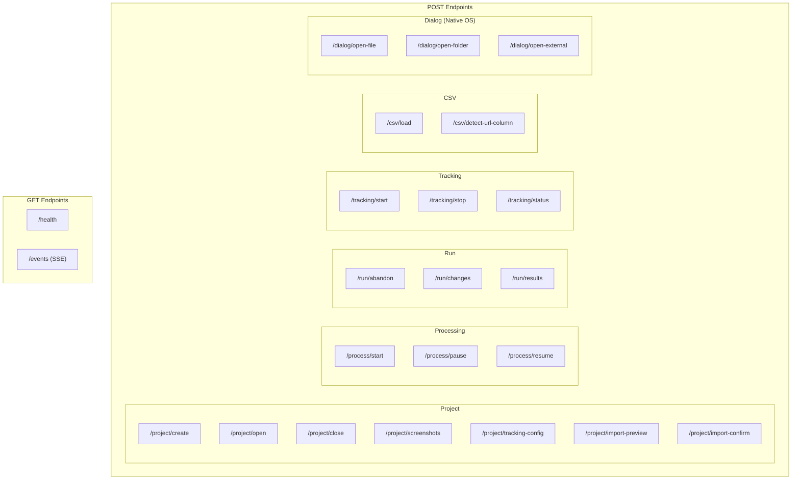
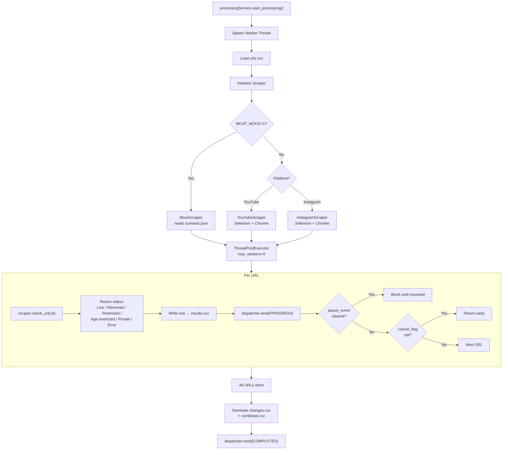
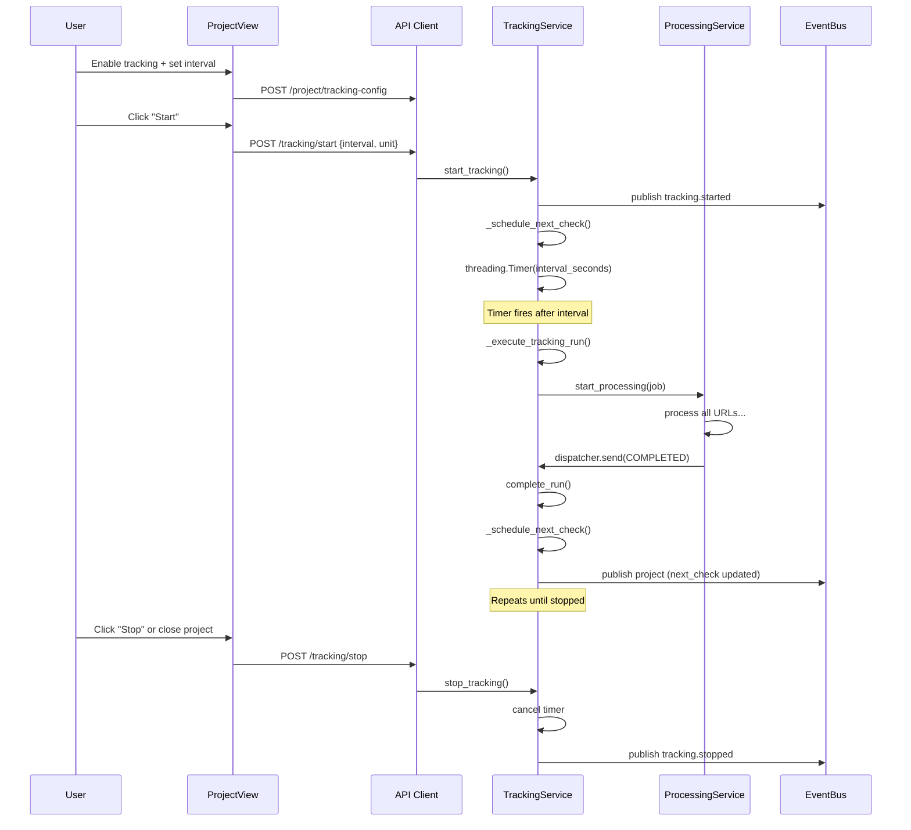
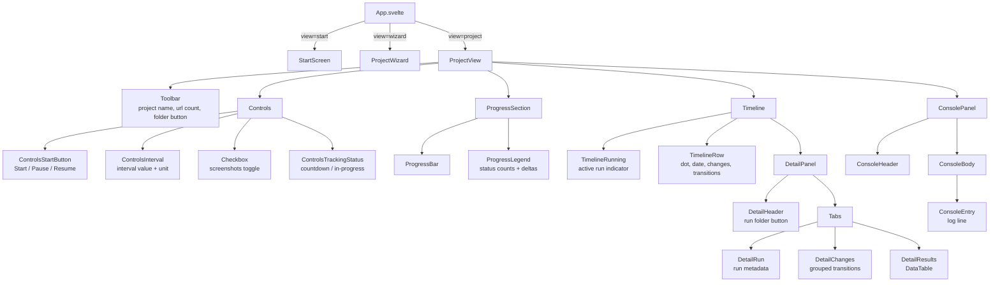
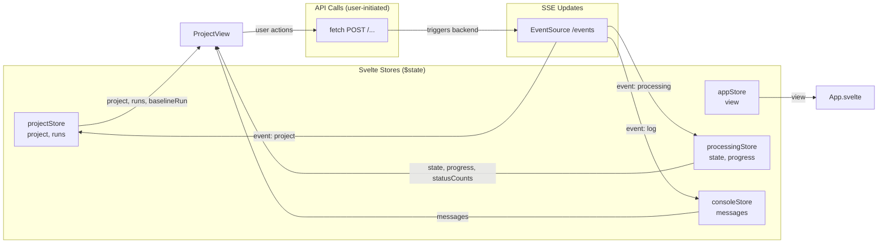

# MCAT Architecture

## System Overview

## Data Flow: User Action → Backend → SSE → UI Update

## SSE Event Flow

## API Endpoints

## Processing Pipeline

## Tracking (Scheduled Runs)

## Frontend Component Tree

## Store → View Data Flow

