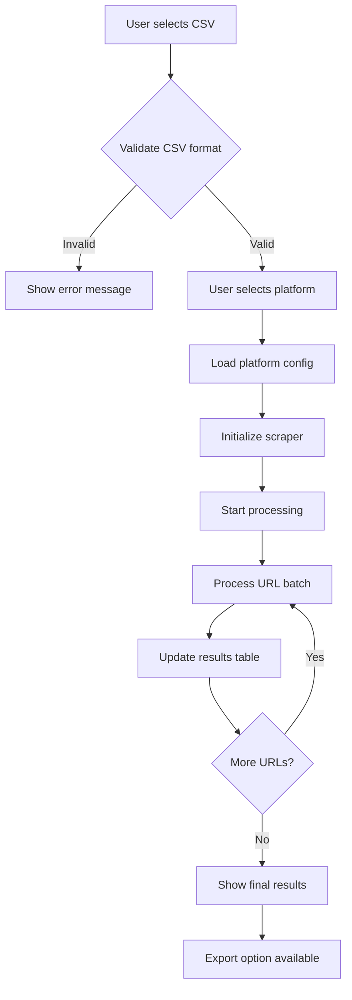

# MCAT Selenium App - Design Document

## Overview
A standalone desktop application for content moderation analysis that processes CSV files containing social media URLs and checks their moderation status across platforms. Built with Dear PyGui and compiled with Nuitka.

**MVP Focus**: CSV processing with URL status checking. Advanced features like Facebook search scraping with login will be implemented in later phases.

## Architecture Overview

```
mcat_app/
├── main.py                 # Application entry point
├── config/
│   ├── __init__.py
│   ├── settings.py         # Configuration loader
│   └── columns.json        # Hardcoded column mappings
├── core/
│   ├── __init__.py
│   ├── driver_manager.py   # WebDriver management
│   └── batch_processor.py  # Main processing pipeline
├── scrapers/
│   ├── __init__.py
│   ├── base_scraper.py     # Abstract base scraper
│   ├── facebook_scraper.py # Facebook/Instagram scraper (MVP: URL checking only)
│   ├── youtube_scraper.py  # YouTube scraper
│   ├── twitter_scraper.py  # Twitter/X scraper
│   ├── tiktok_scraper.py   # TikTok scraper
│   └── facebook_search.py  # Facebook search scraper (Future: Phase 4)
├── gui/
│   ├── __init__.py
│   ├── main_window.py      # Primary GUI controller
│   ├── components/
│   │   ├── __init__.py
│   │   ├── file_picker.py     # File selection component
│   │   ├── column_mapper.py   # 4-column mapping component
│   │   ├── status_display.py  # Pipeline status display
│   │   ├── results_table.py   # Results preview table
│   │   ├── export_panel.py    # Export functionality
│   │   └── login_panel.py     # Login component (Future: Phase 4)
└── utils/
    ├── __init__.py
    ├── csv_handler.py      # CSV I/O operations
    └── state_manager.py    # Application state broadcasting
```

## Core Components

### 1. Configuration System (`config/`)

#### `settings.py`
```python
class AppConfig:
    def __init__(self):
        self.load_config()
    
    def load_config(self):
        # Load column mappings from columns.json
        # Load scraper settings
        # Load GUI defaults
```

#### `columns.json`
```json
{
    "facebook": {
        "default_columns": {
            "post": "Post URL",
            "date": "Created Time",
            "engagement": "Reactions Total", 
            "user": "From Name"
        },
        "common_columns": {
            "post": ["Post URL", "URL", "Link"],
            "date": ["Created Time", "Posted", "Date"],
            "engagement": ["Reactions Total", "Likes", "Shares", "Total Interactions"],
            "user": ["From Name", "User Name", "Author", "Page Name"]
        }
    },
    "twitter": {
        "default_columns": {
            "post": "Tweet URL",
            "date": "Created At",
            "engagement": "Retweet Count",
            "user": "User Name"
        },
        "common_columns": {
            "post": ["Tweet URL", "URL", "Link"],
            "date": ["Created At", "Posted", "Date"],
            "engagement": ["Retweet Count", "Likes", "Favorites"],
            "user": ["User Name", "Author", "Handle", "Screen Name"]
        }
    },
    "youtube": {
        "default_columns": {
            "post": "Video URL",
            "date": "Published At",
            "engagement": "View Count",
            "user": "Channel Title"
        }
    },
    "tiktok": {
        "default_columns": {
            "post": "Video URL", 
            "date": "Create Time",
            "engagement": "Play Count",
            "user": "Author Name"
        }
    }
}
```

### 2. Core Processing (`core/`)

#### `driver_manager.py`
```python
class WebDriverManager:
    """Manages Chrome WebDriver lifecycle and configuration"""
    
    def __init__(self, headless: bool = True)
    def create_driver(self) -> webdriver.Chrome
    def cleanup_driver(self, driver: webdriver.Chrome)
    def cleanup_all_processes()
    def get_driver_pool(self, pool_size: int) -> List[webdriver.Chrome]
```

#### `batch_processor.py`
```python
class BatchProcessor:
    """Main processing pipeline coordinator"""
    
    def __init__(self, state_manager: StateManager)
    def process_csv(self, csv_path: str, platform: str) -> ProcessingResult
    def _validate_csv(self, df: pd.DataFrame, platform: str) -> bool
    def _process_batch(self, urls: List[str], scraper: BaseScraper) -> List[Dict]
    def cancel_processing()
```

### 3. Scraper System (`scrapers/`)

#### `base_scraper.py`
```python
from abc import ABC, abstractmethod

class BaseScraper(ABC):
    """Abstract base class for all platform scrapers"""
    
    def __init__(self, driver_manager: WebDriverManager)
    
    @abstractmethod
    def check_url_status(self, url: str) -> ScrapingResult
    
    @abstractmethod
    def get_platform_name(self) -> str
    
    def batch_check(self, urls: List[str]) -> List[ScrapingResult]
    def cleanup()

class ScrapingResult:
    """Standardized result format"""
    def __init__(self):
        self.url: str = ""
        self.status: str = ""  # "Live", "Removed", "Restricted", "Error"
        self.info: str = ""    # Additional details
        self.timestamp: str = ""
        self.error_message: str = ""
        self.platform: str = ""
```

#### Individual Scrapers
Each scraper inherits from `BaseScraper`:
- `facebook_scraper.py` - Facebook/Instagram posts
- `youtube_scraper.py` - YouTube videos  
- `twitter_scraper.py` - Twitter/X posts
- `tiktok_scraper.py` - TikTok videos

### 4. GUI System (`gui/`)

#### `main_window.py`
```python
class MainWindow:
    """Primary GUI controller using Dear PyGui"""
    
    def __init__(self)
    def setup_ui()
    def run()
    
    # Event handlers
    def on_file_selected(self, file_path: str)
    def on_platform_selected(self, platform: str)
    def on_column_mapped(self, column_type: str, column_name: str)
    def on_start_processing()
    def on_cancel_processing()
    def on_export_results()
    
    # UI updates
    def update_status_display(self, status: ProcessingStatus)
    def update_results_table(self, results: List[ScrapingResult])
    def update_column_dropdowns(self, csv_columns: List[str])
```

#### `components/column_mapper.py`
```python
class ColumnMapper:
    """4-column mapping component for CSV files"""
    
    def __init__(self, parent_window)
    def setup_column_selectors()
    def populate_dropdowns(self, csv_columns: List[str])
    def get_column_mapping(self) -> Dict[str, str]
    def validate_mapping(self) -> bool
```

## Processing Pipeline

### Pipeline States
The application broadcasts these states during processing:

```python
class ProcessingState(Enum):
    IDLE = "Ready"
    LOADING_CSV = "Loading CSV file..."
    VALIDATING_DATA = "Validating data format..."
    INITIALIZING_SCRAPERS = "Setting up scrapers..."
    PROCESSING_URLS = "Processing URLs..."
    FINALIZING_RESULTS = "Finalizing results..."
    COMPLETED = "Processing completed"
    ERROR = "Error occurred"
    CANCELLED = "Processing cancelled"
```

### Detailed Pipeline Flow



### Progress Measurement

Instead of a traditional progress bar, we show:

1. **Current State**: "Processing URLs... (45/127)"
2. **Live Stats**: 
   - Total URLs: 127
   - Processed: 45
   - Live: 23
   - Removed: 15
   - Errors: 7
3. **Current Action**: "Checking YouTube video #46..."

### State Broadcasting System (`utils/state_manager.py`)

```python
class StateManager:
    """Centralized state management and broadcasting"""
    
    def __init__(self)
    def broadcast_state(self, state: ProcessingState, data: Dict = None)
    def subscribe(self, callback: Callable)
    def get_current_state(self) -> ProcessingState
    def update_progress(self, current: int, total: int, stats: Dict)
```

## GUI Layout Specification

### Main Window Layout (MVP)
```
┌─────────────────────────────────────────────────────┐
│ MCAT Content Moderation Checker                    │
├─────────────────────────────────────────────────────┤
│ File Selection                                      │
│ ┌─────────────────────┐ [Browse]                   │
│ │ No file selected    │                             │
│ └─────────────────────┘                             │
│                                                     │
│ Platform: [Facebook ▼]                             │
│                                                     │
│ Column Mapping:                                     │
│ Post Column:       [Post URL        ▼]             │
│ Date Column:       [Created Time    ▼]             │  
│ Engagement Column: [Reactions Total ▼]             │
│ User Column:       [From Name       ▼]             │
│                                                     │
│ ┌─────────────────────────────────────────────────┐ │
│ │ Status: Ready                                   │ │
│ │ ┌─┐ Start Processing    [Cancel] [Export]       │ │
│ └─────────────────────────────────────────────────┘ │
├─────────────────────────────────────────────────────┤
│ Results Preview (First 100 rows)                   │
│ ┌─────────────────────────────────────────────────┐ │
│ │ URL                    │ Status  │ Info         │ │
│ │ ──────────────────────┼─────────┼──────────────│ │
│ │ https://youtube.com/...│ Live    │ Available    │ │
│ │ https://facebook.com/..│ Removed │ Unavailable  │ │
│ │ ...                    │ ...     │ ...          │ │
│ └─────────────────────────────────────────────────┘ │
└─────────────────────────────────────────────────────┘
```

### Real-time Status Display
During processing, the status area shows:
```
┌─────────────────────────────────────────────────┐
│ Status: Processing URLs... (45/127)             │
│                                                 │
│ Current: Checking YouTube video #46            │
│                                                 │
│ Results so far:                                 │
│ ✅ Live: 23    ❌ Removed: 15    ⚠️ Errors: 7   │
│                                                 │
│ [●●●●●●○○○○] 45/127                           │
└─────────────────────────────────────────────────┘
```

## Data Flow

### Input Processing
1. User selects CSV file
2. Load CSV using pandas  
3. User selects platform (Facebook, Twitter, YouTube, TikTok)
4. User maps 4 columns: Post, Date, Engagement, User
5. Validate column mappings and data format
6. Show data preview in results table
7. User confirms and starts processing

### URL Processing
1. Extract URLs from configured column
2. Create batches for parallel processing
3. Initialize appropriate scraper
4. Process each URL and collect results
5. Update GUI in real-time
6. Store results in memory

### Output Generation
1. Preserve all original CSV columns (Post, Date, Engagement, User + any others)
2. Combine with scraping results
3. Show full results in preview table
4. User can export enhanced CSV with additional columns:
   - `status` (Live/Removed/Restricted/Error)
   - `info` (Additional details)
   - `check_timestamp` (When checked)
   - `error_message` (If applicable)
   - `platform` (Detected platform)

## Implementation Priority

### Phase 1 - MVP Core (CSV Processing)
1. Set up project structure
2. Implement `WebDriverManager`
3. Create `BaseScraper` abstract class
4. Implement `StateManager`
5. Basic GUI with file picker and column selectors
6. Configuration system with `columns.json`

### Phase 2 - Single Platform MVP
1. Implement YouTube scraper (most reliable)
2. Basic processing pipeline with 4-column mapping
3. Results display with data preservation
4. Export functionality with enhanced CSV

### Phase 3 - Multi-Platform Expansion
1. Implement Facebook, Twitter, TikTok scrapers
2. Platform-specific column configurations
3. Error handling improvements
4. Performance optimization

### Phase 4 - Advanced Features (Future)
1. **Facebook Search Scraping** with login system
2. Real-time search term scraping
3. Post ranking analysis
4. Advanced authentication handling

### Phase 5 - Production Polish
1. Progress visualization refinements
2. User preferences and settings
3. Advanced error recovery
4. Nuitka compilation and deployment

## Configuration Files

### Required Configuration
- Column mappings per platform
- Scraper timeouts and retry settings
- GUI theme and layout preferences
- WebDriver configuration options

### Runtime Settings
- Worker thread count (constant for now)
- Processing batch size
- Results preview row limit
- Export format options

## Future Features (Post-MVP)

### Facebook Search Scraping (Phase 4)
- **Login System**: Secure credential handling in Dear PyGui
- **Search Interface**: Term input and result ranking capture  
- **Session Management**: Persistent login across searches
- **Rate Limiting**: Anti-bot detection avoidance
- **Result Export**: Ranked post data for analysis

### Enhanced GUI Layout (Future)
```
┌─────────────────────────────────────────────────────┐
│ MCAT Content Moderation Checker                    │
├─────────────────────────────────────────────────────┤
│ [CSV Processing] [Facebook Search] Tabs            │
│                                                     │
│ Facebook Search Tab:                                │  
│ Login: [username] [password] [Login] Status: ❌     │
│ Search: [climate change______] [Start Search]      │
│ Results: Ranking | URL | Text | Author | Date      │
└─────────────────────────────────────────────────────┘
```

This modular design ensures each component is maintainable, testable, and can be developed independently while maintaining clear interfaces between components. The MVP focuses on the core CSV processing functionality, with advanced search features planned for later phases.